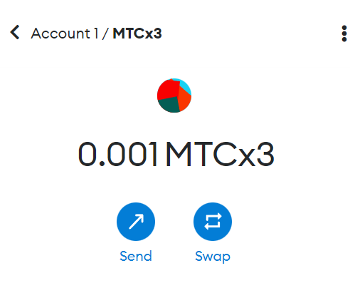

# Walkthroughs
## Issue & Leverage
### Setup
###
- Create a new SetToken `index` with aToken being component for the index, e.g. aWmatic for wmatic.
- Initialize the leverage related modules after having controller and rest of ecosystem already deployed. 
```javascript
await lev3xIssuanceModule .initialize(index.address, ether(0), ether(0), ether(0), deployer.address, ADDRESS_ZERO);
await lev3xAaveLeverageModule.initialize(index.address,  D.polygon2.wmatic, D.polygon2.dai);
```
- In order to initialize `Lev3xAaveLeverageModul` make sure you allow the index and register the issuance module in that order.
```javascript
await lev3xAaveLeverageModule.updateAllowedSetToken(index.address, true);
await lev3xAaveLeverageModule.initialize(index.address,  D.polygon2.wmatic, D.polygon2.dai);
await lev3xAaveLeverageModule.registerToModule(index.address, lev3xIssuanceModule.address);
```
### Issue
- Issue new 0.001 index
```typescript
await issueModule.issue("0xcd15de9546390f5ee242601d425cf92b812c420d", "1000000000000000", "0x55ec991D34569941a77e90b54Fcc3e687234FfCD", "1500000000000000")
```
- Balance of index is 0.001 as shown by wallet


- Interactions that took place to issue index as shown in polygonscan. Notice the interactions with Aave.


### Leverage
- At this point manager (or a bot) jumps in and apply leverage on the index
```
await levModule.lever("0xcd15de9546390f5ee242601d425cf92b812c420d", "0x8f3cf7ad23cd3cadbd9735aff958023239c6a063", "0x0d500B1d8E8eF31E21C99d1Db9A6444d3ADf1270", ether(0.2), "0", "UNISWAP", "0x"); // twice
```
- Notice here index starts to receive debt tokens (awMatic) after applying the leverage


- This will eb applied successively (i.e. with proper ratios), according to how SetProtocol was setup, so you endup getting the target leverage.

## Bear Index
### Setup
- Create an index (SetToken) with dai representing the component of the set.
```
await setTokenCreator.create(
 [D.polygon2.adai], 
 [ether(0.01)], 
 [
   lev3xAaveLeverageModule.address,
   lev3xIssuanceModule.address
 ],  deployer.address, "Bear", "MTCBEAR"
);
```
- Comfigure IssuanceModule & AaveLeverageModule  with new Bear index
```
await lev3xIssuanceModule .initialize(index.address, ether(0), ether(0), ether(0), deployer.address, ADDRESS_ZERO);
await lev3xAaveLeverageModule.updateAllowedSetToken(index.address, true);
await lev3xAaveLeverageModule.initialize(index.address,  D.polygon2.dai, D.polygon2.wmatic);   
await lev3xAaveLeverageModule.registerToModule(index.address, lev3xIssuanceModule.address);
```
### Short sell the matic 
- After approving IssuanceModule, go ahead issue new tokens from bear index
```
await lev3xIssuanceModule.issue(index.address, "1000000000000000000", deployer.address, "1500000000000000000")
```
  - Approving IssuanceModule

  - Index internal interactions

  - Metamask wallet shows the balance of the newly created Bear index 

  - Bear index itself holds the dai used to issue the index


- Manager Leverages the index, 
```
await lev3xAaveLeverageModule.lever(index.address, D.polygon2.wmatic, D.polygon2.dai, ether(0.0002), "0", "UNISWAP", "0x")
```
  - Internal interactions

  - Index now holds more dai due to leveraging

  - Another leverage
